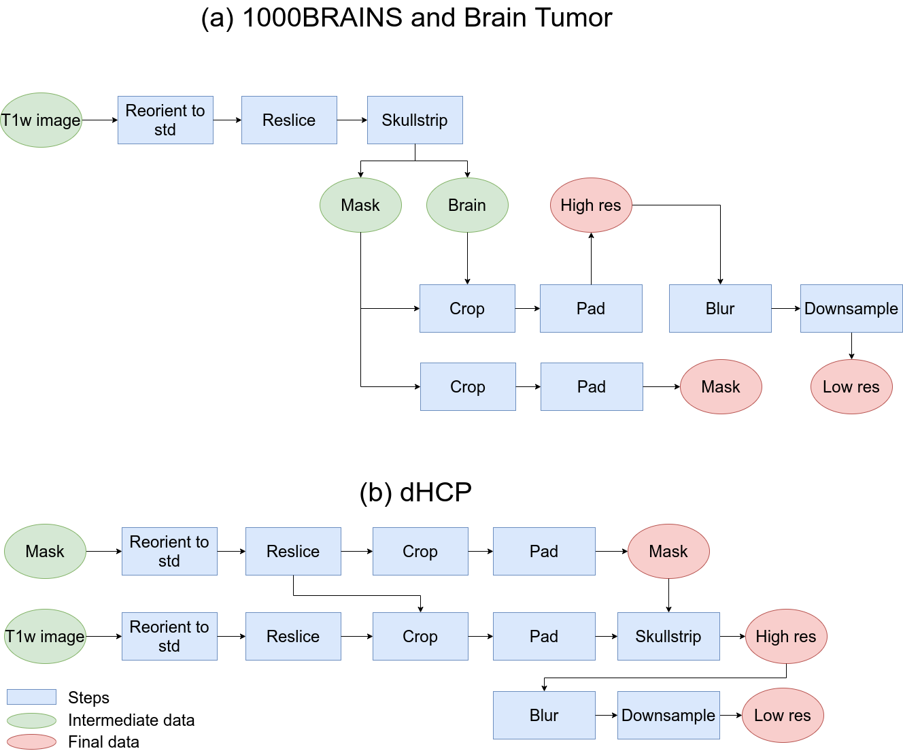

# brainsGAN3D_Preprocessing

## Requirements
Here you will find the preprocessing routines used in the main project
`brainsGAN3D`. This pipelines runs on the GPU, but can be made to run on the
CPU with small changes to the way it calls HD-bet.

The conda environment is available, and can be installed using the following command:

```bash
conda env create -f environment.yml
```

### HD-Bet

You will probably need to install HD-bet on your own. The link with
instructions can be found [here](https://github.com/MIC-DKFZ/HD-BET).


### MRtrix

MRtrix can be installed via anaconda following the instructions [here](https://www.mrtrix.org/download/linux-anaconda/).


### FSL

FSL can be installed with their custom scripts, as outlined [here](https://fsl.fmrib.ox.ac.uk/fsl/fslwiki/FslInstallation).

## Usage

There are two entry points for this processing. The parameters are better explained in the next section. It is possible to use the scipt `process_serial.sh` to perform the whole processing using a single GPU, as 

```bash
bash src/process_serial.sh -l dataset.txt -s 200 240 260 -f 2
```

complementary, one can use 

```bash
bash src/process_parallel.sh -l dataset.txt -s 200 240 260 -f 2
```

This will use every available GPU to perform the preprocessing. It is possible to control which GPUs are going to be used via the `CUDA_VISIBLE_DEVICES` environment variable. E.g.

```bash
CUDA_VISIBLE_DEVICES=1,3 bash src/process_parallel.sh -l dataset.txt -s 200 240 260 -f 2
```

Either of these will create a folder `derived` with three subfolders within `HighRes`, `LowRes`, `Mask`. These contain the processed data.

## Options

```
-l / --list <filename>: List of files to be processed
-s / --size <nx> <ny> <nz>: Sizes of the padded dataset 
-f / --factor <factor>: Downsampling factor
```

## Datalists

The `dataset.txt` input is a simple file with the paths for all the scans that need processing. E.g.,

```
/path/to/sub1.nii.gz
/path/to/sub2.nii.gz
/path/to/sub3.nii.gz
/path/to/sub4.nii.gz
...
```

The data list for the main code can be generated with the helper script `create_file_list.sh`.


## Flowchart



